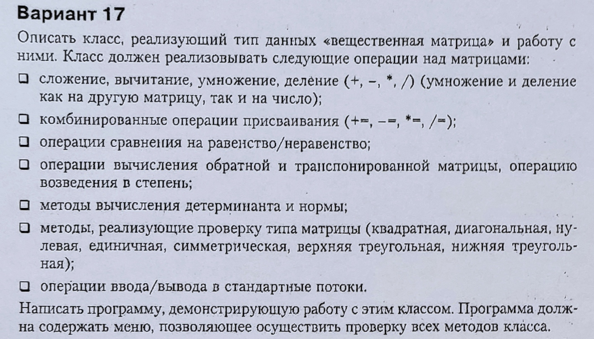

# BMC - basic matrix calculator
This is my homework for semester 6 in MIPT. A simple program with a simple
goal - be a matrix calculator. It is still in development and I hope to finish
it by June 2022 or I'll get expelled.

# The task itself

Maybe I will translate it, maybe not.

<!-- vim:set tw=78: -->
